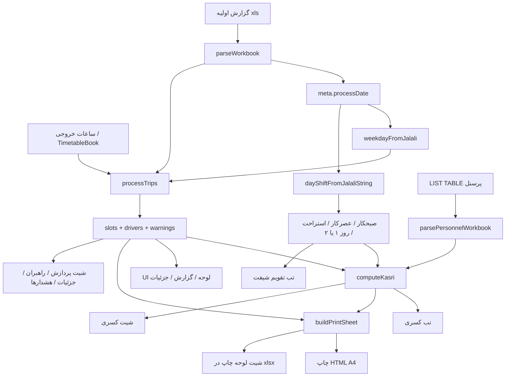

# نقشه فنی لوحه‌ساز سیر و اعزام

راهنمای کامل محصول، جریان کار، و نقشهٔ کد. مخاطب: نگهداری و توسعهٔ بعدی.

مخزن: [hoseindashti1981/Train-Operators-Trips](https://github.com/hoseindashti1981/Train-Operators-Trips)

نسخهٔ زنده (PWA): [https://hoseindashti1981.github.io/Train-Operators-Trips/docs/](https://hoseindashti1981.github.io/Train-Operators-Trips/docs/)

---

## ۱. این برنامه چیست

جایگزین وب برای ماکروی اکسل «لوحه‌ساز سیر و اعزام» خط ۵ مترو (گلشهر ↔ صادقیه).

گزارش روزانهٔ نرم‌افزار سیر (فایل `.xls` / `.xlsx` / `.xlsm`) را می‌گیرد و از آن **لوحهٔ خروجی** می‌سازد: فقط راهبر (مستر / H1) و کمک‌راهبر (اسلیو / R) روی **ساعت‌هایی که در شیت خروجی نوشته شده** قرار می‌گیرند.

هدف عملیاتی لوحه این نیست که کل روز را نشان بدهد. در عملیات، هر راهبر چند نیم‌تریپ می‌رود؛ این برنامه **اولین نیم‌تریپ هر نفر** را ثبت می‌کند تا فردا همان ساعت برایش تکرار نشود.

| نقش در لوحه | ستون چاپ | از گزارش اولیه |
|---|---|---|
| راهبر / مستر / اصلی | H1 | نوع اعزام شامل راهبر، مستر، اصلی، master |
| کمک‌راهبر / اسلیو | R | نوع اعزام شامل کمک، اسلیو، slave |
| راهبر آموزشی | T | نوع اعزام شامل آموزش — اختیاری در UI |

سایر نقش‌ها (مسئول شیفت، راهبر پایانه، …) وارد لوحهٔ تریپ نمی‌شوند.

---

## ۲. طرز کار برای کاربر

1. فایل **گزارش اولیه** را بکشید یا «بارگذاری اولیه» / «نمونه گزارش».
2. **نوع روز** (ساعات لوحه) خودکار از تاریخ شمسی فایل است، یا دستی: روز عادی / پنجشنبه / جمعه.
3. **صبحکار / عصرکار / استراحت / روز ۱ یا ۲** از **تقویم ابدی** روی همان تاریخ فایل پر می‌شود. دستی هم قابل اصلاح است.
4. در صورت نیاز **ساعات خروجی** را ویرایش کنید (در همین مرورگر ذخیره می‌شود).
5. **لیست پرسنل** (`LIST TABLE.xlsm`) یک‌بار بار می‌شود؛ برای به‌روز کردن، دکمهٔ همان نام. نمونه داخل پروژه به‌صورت پیش‌فرض خوانده می‌شود.
6. تب‌ها:
   - **لوحه پردازش** — جدول ساعت × مبدأ با نام راهبر و کمک
   - **گزارش راهبران** — سورت فامیلی، شماره پرسنلی، ساعت‌ها یکی‌یکی
   - **جزئیات اعزام** — همهٔ نیم‌تریپ‌های نام‌دار
   - **هشدارها** — کسری ساعت لوحه، تعداد حرکت غیرمعمول
   - **کسری شیفت** — کسری صبح/عصر + اضافه‌کار
   - **تقویم شیفت** — ماه‌نمای ابدی با صبح / عصر / استراحت و روز بلوک
   - **ساعات خروجی** — ویرایش لیست ساعت گلشهر / تهران
7. **خروجی اکسل** چند شیت می‌سازد. **چاپ لوحه** برگهٔ A4 شبیه فایل «لوحه اعزام» را به چاپ ویندوز می‌فرستد. اضافه‌کار بولد، ایتالیک، زمینه خاکستری.

ذخیرهٔ محلی مرورگر:

| کلید | محتوا | منبع حقیقت؟ |
|---|---|---|
| `lohe-output-hours-v1` | ساعات گلشهر/تهران برای سه نوع روز | بله، ویرایش کاربر |
| `lohe-personnel-v1` | لیست پرسنل خط ۵ | بله، تا فایل جدید |
| `lohe-shift-duty-v1` | آخرین حرف صبحکار/عصرکار | خیر؛ تقویم ابدی منبع است. این کلید فقط پشتیبان اصلاح دستی است |

سرور حساب کاربری ندارد؛ همهٔ پردازش در مرورگر است.

---

## ۳. دو تشخیص خودکار (مهم)

هر دو از تاریخ شمسی فایل می‌آیند، ولی کارشان یکی نیست.

| کنترل UI | از کجا | چه می‌کند |
|---|---|---|
| نوع روز | `weekdayFromJalali` در `jalali.ts` | قالب **ساعات لوحه**: عادی / پنجشنبه / جمعه |
| صبحکار، عصرکار، استراحت، روز ۱/۲ | `dayShiftFromJalaliString` در `shift-calendar.ts` | **حرف شیفت** همان روز از تقویم ابدی |

ترتیب در `LoheApp`:

1. باز شدن اپ: تقویم روی **امروز** → فیلد صبحکار/عصرکار امروز.
2. بارگذاری گزارش: `meta.processDate` و اگر نبود `meta.reportDate` → `applyCalendarDay` → همان فیلدها با تاریخ فایل عوض می‌شوند.
3. کلیک روی روز در تب تقویم: همان کار، بدون فایل جدید.
4. تغییر دستی A/B/C: override همان نشست (و `localStorage`)؛ فایل بعدی دوباره از تقویم می‌آید.

جمعه ساعات لوحه عوض می‌شود؛ **حروف شیفت از چرخهٔ ۶روزه نمی‌پرند.**

---

## ۴. دامنهٔ عملیاتی و تقویم ابدی

### دو مدل شیفت

- **۹ ساعته:** در هر شیفت کاری ۴ نیم‌تریپ. با جدول فعلی: دو روز صبح، دو روز استراحت، دو روز عصر (ترتیب شخص: صبح → استراحت → عصر).
- **۱۲ ساعته:** دو روز **روزِ میان** `07:30–19:30` (۶ نیم‌تریپ)، دو روز **شب** `19:30–07:30 فردا` (۲ نیم‌تریپ)، دو روز استراحت.

حروف A/B/C برای هر دو نوع **همیشه جفت‌اند**: اگر B صبحکار باشد، ۹B صبح است و ۱۲B روزکار؛ همان روز A عصرکار است پس ۱۲A شبکار.

ساعت کارت ۱۲ ساعته `07:30` / `19:30` است؛ شروع تریپ روزکار حدود `08:00` و شب حدود `19:50`. این‌ها یکی نیستند و در این مرحله در تطبیق ساعت لوحه دخالت داده نمی‌شوند.

### مبدأ و چرخه (کد شده)

فایل: [`src/lib/lohe/shift-calendar.ts`](src/lib/lohe/shift-calendar.ts)

- مبدأ ابدی: **۱۴۰۵/۰۷/۰۷** = روز بلوک ۱، صبح **B**، عصر **A**، استراحت **C** (`SHIFT_ANCHOR` + `SHIFT_BLOCKS[0]`).
- فرمول: `cycleIndex = ((روز تا مبدأ) mod 6 + 6) mod 6`
- `blockIndex = floor(cycleIndex / 2)` و `blockDay = cycleIndex زوج → ۱، فرد → ۲`

| روز چرخه | روز بلوک | صبحکار | عصرکار | استراحت | ۱۲ صبح‌زود | گروه ۱۲ |
|---|---|---|---|---|---|---|
| ۰ | ۱ | B | A | C | B | ۳ (صبح‌زود ≠ شب امشب) |
| ۱ | ۲ | B | A | C | A | ۲ |
| ۲ | ۱ | A | C | B | A | ۳ |
| ۳ | ۲ | A | C | B | C | ۲ |
| ۴ | ۱ | C | B | A | C | ۳ |
| ۵ | ۲ | C | B | A | B | ۲ |

صبح‌زود ۱۲:

- روز ۱: `evening` بلوک قبلی
- روز ۲: `evening` همین روز (= شب امشب)

۱۲ روزکار = صبحکار؛ ۱۲ شب امشب = عصرکار.

نمونهٔ هفتهٔ مبدأ (تست‌شده):

| تاریخ | هفته | روز بلوک | صبح | عصر | استراحت |
|---|---|---|---|---|---|
| ۱۴۰۵/۰۷/۰۷ | سه‌شنبه | ۱ | B | A | C |
| ۱۴۰۵/۰۷/۰۸ | چهارشنبه | ۲ | B | A | C |
| ۱۴۰۵/۰۷/۰۹ | پنجشنبه | ۱ | A | C | B |
| ۱۴۰۵/۰۷/۱۰ | جمعه | ۲ | A | C | B |
| ۱۴۰۵/۰۷/۱۱ | شنبه | ۱ | C | B | A |
| ۱۴۰۵/۰۷/۱۲ | یکشنبه | ۲ | C | B | A |
| ۱۴۰۵/۰۷/۱۳ | … | ۱ | B | A | C | (برگشت چرخه) |

نوع `DayShift`: `iso`, `weekdayName`, `cycleIndex`, `blockDay`, `morning`, `evening`, `rest`, `early12`, `day12`, `night12`, `groups12`.

کسری هنوز فقط `morning` / `evening` را مصرف می‌کند؛ `early12` برای مرحلهٔ بعد در UI تقویم نمایش داده می‌شود.

### این لیست ساعت عمداً چه می‌گیرد

گلشهر: ۳ نیم‌تریپ اول ۱۲ صبح‌زود/دیشب + حدود ۱۱ نیم‌تریپ اول ۹ صبح + حدود ۱۴ نیم‌تریپ اول ۹ عصر + ۳ نیم‌تریپ اول ۱۲ شب.

تهران: اولین تریپ صبح = ۱۲ شبِ قبل + ۳ نیم‌تریپ اول ۹ صبح + ۳ یا ۴ نیم‌تریپ اول ۹ عصر.

اسامی ۱۲ ساعتهٔ **روزکار** وسط روز در این لیست نمی‌آیند. ساعت‌ها حدودی‌اند و با جدول همان روز عوض می‌شوند.

---

## ۵. معماری کلی

دو مسیر استقرار روی یک کد منبع:

```text
مرورگر (بدون سرور پردازش)
        │
        ▼
 LoheApp
        │  ساعات (localStorage)
        │  پرسنل (localStorage)
        │  تقویم ابدی ← تاریخ فایل یا امروز یا کلیک ماه
        ▼
 processWorkbook(ArrayBuffer)
        │
        ├─ parse-report      → Trip[] + meta.تاریخ
        ├─ jalali            → نوع روز (ساعات)
        ├─ shift-calendar    → صبحکار/عصرکار/روز بلوک
        ├─ templates         → TimetableRow[]
        ├─ match             → SlotAssignment[]
        ├─ driver-report     → DriverRow[]
        └─ kasri             → کسری / اضافه‌کار
                │
                ├─ UI جدول‌ها + چاپ HTML
                └─ export-workbook / print-sheet → .xlsx
```

| محیط | ورودی | خروجی |
|---|---|---|
| پیش‌نمایش Grok / Vercel | TanStack Start + Vite روی `:8080` | SSR/CSR کامل پروژه |
| GitHub Pages | بیلد استاتیک `vite.pages.config.ts` | پوشهٔ `docs/` با `base=/Train-Operators-Trips/docs/` |

پردازش فایل اکسل فقط کلاینت است (`xlsx` با import پویا تا SSR نشکند).

---

## ۶. جریان داده



تطبیق هر خانهٔ لوحه: **مبدأ + ساعت + نقش**. جای ستون در فایل اولیه مهم نیست؛ عنوان ستون پیدا می‌شود.

نرمال‌سازی فارسی: `ي/ى → ی`، `ك → ک`، ارقام فارسی/عربی، حذف نیم‌فاصله. نام نمایشی: `نام‌خانوادگی + نام`.

---

## ۷. نقشهٔ ماژول‌ها

### UI

| فایل | نقش |
|---|---|
| [`src/routes/index.tsx`](src/routes/index.tsx) | صفحهٔ اصلی؛ فقط `LoheApp` |
| [`src/components/lohe-app.tsx`](src/components/lohe-app.tsx) | پوسته، بارگذاری، تب‌ها، اتصال تاریخ فایل به تقویم، کسری، خروجی |
| [`src/components/shift-calendar.tsx`](src/components/shift-calendar.tsx) | ماه‌نمای ابدی؛ کلیک روز = اعمال صبحکار/عصرکار |
| [`src/components/hours-editor.tsx`](src/components/hours-editor.tsx) | ویرایش ساعات سه نوع روز |
| [`src/components/lohe-print.tsx`](src/components/lohe-print.tsx) | جدول چاپ A4؛ اضافه‌کار بولد/ایتالیک/خاکستری |
| [`src/components/pwa-bar.tsx`](src/components/pwa-bar.tsx) | نصب PWA و وضعیت شبکه |
| [`src/styles.css`](src/styles.css) | Tailwind + استایل چاپ `.lohe-ot` |

### موتور لوحه — [`src/lib/lohe/`](src/lib/lohe/)

```text
index.ts            صادرات یکپارچه
types.ts            Trip, Slot, ProcessResult, …
xlsx-load.ts        import پویای SheetJS
normalize.ts        فارسی، نقش، مبدأ، ساعت، displayName
parse-report.ts     خواندن گزارش پراکنده / سلول ادغام‌شده
jalali.ts           شمسی ↔ میلادی، روز هفته، طول ماه، امروز
shift-calendar.ts   مبدأ ۱۴۰۵/۰۷/۰۷، چرخهٔ ۶روزه، DayShift، monthGrid
templates.ts        ساعات پیش‌فرض weekday/thursday/friday
timetable-store.ts  ذخیره/بازیابی ساعات
match.ts            پر کردن هر ساعت لوحه از Trip[]
driver-report.ts    تجمیع نفر، سورت فامیلی
process.ts          ارکستراسیون parse + match + گزارش
personnel.ts        خواندن LIST TABLE و ShiftDuty
kasri.ts            کسری صبح/عصر و اضافه‌کار
print-sheet.ts      AOA چاپ شبیه اکسل اعزام
export-workbook.ts  ورک‌بوک چندشیتی
engine.node-test.ts تست‌های موتور (۱۲ مورد)
```

وابستگی (بدون حلقه):

```text
normalize ← parse-report
          ← match
          ← driver-report
          ← personnel
jalali    ← process          (نوع روز / ساعات)
          ← shift-calendar   (حروف شیفت)
templates ← timetable-store
          ← match            ← process
personnel ← kasri            ← LoheApp / print-sheet / export
shift-calendar ← LoheApp / shift-calendar.tsx
process   ← LoheApp
print-sheet ← lohe-print + export-workbook
```

توابع کلیدی تقویم: `dayShiftOn`, `dayShiftFromJalaliString`, `dutyFromDayShift`, `monthGrid`, `cycleIndexOf`.

توابع کلیدی تاریخ: `jalaliToGregorian`, `gregorianToJalali`, `parseJalaliDate`, `formatJalali`, `jalaliDiffDays`, `jalaliToday`, `weekdayFromJalali`.

### PWA و آدرس

| فایل | نقش |
|---|---|
| [`src/lib/pwa/policy.ts`](src/lib/pwa/policy.ts) | ثبت SW فقط در context امن، نه روی grok.com |
| [`src/lib/pwa/register.ts`](src/lib/pwa/register.ts) | `sw.js` با `scope` نسبی |
| [`src/lib/public-url.ts`](src/lib/public-url.ts) | مسیر دارایی نسبت به `BASE_URL` |
| [`public/sw.js`](public/sw.js) | precache پوسته + شبکه برای ناوبری |
| [`public/manifest.json`](public/manifest.json) | آیکون، `file_handlers` برای xls |
| [`vite.pages.config.ts`](vite.pages.config.ts) | بیلد استاتیک GitHub Pages |
| [`scripts/build-pages.mjs`](scripts/build-pages.mjs) | کپی `dist-pages` → `docs/` |
| [`index.md`](index.md) + [`_config.yml`](_config.yml) | ریدایرکت ریشه به `/docs/` |

---

## ۸. قراردادهای مهم کد

### گزارش اولیه

هدر از روی متن ستون کشف می‌شود نه ایندکس ثابت: نوع اعزام، نام، نام خانوادگی، کد پرسنلی، مبدأ، مقصد، زمان حرکت، تاریخ پردازش.

شیت با بیشترین امتیاز هدر انتخاب می‌شود. سلول ادغام‌شده پر می‌شود. ساعت هم رشته است هم سریال اکسل (بدون شیفت timezone).

اگر فایل لوحهٔ خالی / قالب باشد، رد می‌شود.

### ساعات خروجی

هر ردیف زوج `[گلشهر، تهران]` است. خالی = آن سمت حرکت ندارد. ردیف کاملاً خالی = فاصلهٔ بصری در جدول.

بخش روز از روی ساعت نمونه:

- صبح: قبل از ۱۲ (و نه بعد از ۱۹)
- میان‌روز: ۱۲ تا ۱۹
- پایان خط / عصر: ≥ ۱۹ یا < ۴

برای کسری: صبح + میان‌روز = دورهٔ **صبحکار**؛ پایان خط = **عصرکار**.

### پرسنل و کسری

ستون‌های LIST TABLE: ردیف، نام، نام خانوادگی، کد پرسنلی، سمت، شیفت کاری، نوع شیفت (A/B/C)، محل کار.

کسری فقط برای **راهبر قطار** غیر منفک. پایانه و مسئول شیفت در استخر کسری نیستند.

ورودی `duty` الان از تقویم (تاریخ فایل) می‌آید:

- کسری صبح: حرف = صبحکار تقویم و در تریپ‌های صبح/میان‌روز لوحه نیست.
- کسری عصر: حرف = عصرکار تقویم و در تریپ‌های عصر نیست.
- اضافه‌کار: روی لوحه هست ولی حرفش نه صبحکار است نه عصرکار (معمولاً استراحت همان روز). در چاپ بولد + ایتالیک + زمینه خاکستری. در اکسل شیت «کسری» هم لیست می‌شود.

تطبیق نفر: اول کد پرسنلی، بعد نام فشرده.

### خروجی اکسل

1. پردازش  
2. گزارش راهبران  
3. جزئیات اعزام  
4. هشدارها  
5. لوحه چاپ (قالب A4 با ستون‌های R / T / H1 و پاورقی کسری)  
6. کسری (اگر لیست پرسنل باشد)

چاپ مرورگر همان جدول را با `@media print` نشان می‌دهد؛ بقیهٔ UI مخفی است.

---

## ۹. نمونه فایل‌ها

| مسیر | کاربرد |
|---|---|
| `public/samples/gozaresh-avaliye.xls` | گزارش روزانه نمونه |
| `public/samples/list-table.xlsm` | لیست پرسنل خط ۵ (۱۸۹ نفر) |

---

## ۱۰. تست

```bash
npm test
```

موتور لوحه: `node --import jiti/register --test src/lib/lohe/engine.node-test.ts` — ۱۲ تست، از جمله:

- نقش فارسی/عربی و سریال ساعت
- چهارشنبه بودن `1402/03/03`
- تطبیق مستر/اسلیو نمونه، سورت فامیلی، ساعات سفارشی
- رد قالب خالی، چاپ A4، کسری از LIST TABLE
- **تقویم ابدی:** هفتهٔ ۱۴۰۵/۰۷/۰۷ تا ۱۲، برگشت چرخه در ۱۳، `groups12` روز ۱ و ۲، roundtrip شمسی↔میلادی مبدأ

---

## ۱۱. اجرا و استقرار

محلی:

```bash
npm install
npm run dev          # http://localhost:8080
npm run build:pages  # بازسازی docs/ برای GitHub Pages
```

GitHub Pages از `main` / پوشهٔ `docs` سرو می‌شود. ریشه با Jekyll به `/docs/` می‌رود. `.nojekyll` داخل `docs/` است تا Bundler فایل‌های زیرخط‌دار را نخورد.

PWA را از پیش‌نمایش Grok نصب نکنید (iframe). از آدرس GitHub در تب جدا: کروم Install app / آیفون Add to Home Screen. بار اول آنلاین؛ بعد فایل محلی آفلاین پردازش می‌شود.

---

## ۱۲. کارهای انجام‌شده (سیر محصول)

1. ماژول VBA اکسل → وب‌اپ پردازش گزارش پراکنده.
2. تطبیق عنوان ستون + مبدأ/ساعت/نقش؛ نه ایندکس ثابت.
3. شیت راهبران با سورت فامیلی و ساعت‌های یکی‌یکی.
4. ویرایش ساعات خروجی و ذخیره در مرورگر.
5. تشخیص نوع روز (ساعات) از تاریخ شمسی.
6. PWA تقریباً آفلاین + مسیر GitHub Pages `/docs/`.
7. دکمهٔ چاپ لوحه شبیه فایل اعزام (تاریخ پویا، ساعات همان روز).
8. لیست پرسنل + کسری صبح/عصر + علامت اضافه‌کار.
9. تقویم ابدی شیفت (مبدأ ۱۴۰۵/۰۷/۰۷، چرخهٔ ۶روزه، روز ۱/۲، صبح/عصر/استراحت).
10. اتصال تاریخ فایل ورودی به همان تقویم برای پر کردن فیلدهای صبحکار/عصرکار.
11. نقشهٔ فنی همین فایل.

هنوز ساخته نشده:

- تفکیک ۹ ساعته و ۱۲ ساعته در محاسبهٔ کسری (حرف روز فعلاً برای هر دو یکی است)
- استفاده از `early12` داخل کسری / چاپ
- ذخیرهٔ لیست راهبران هر شیفت جدای از LIST TABLE
- override تک‌روزه برای استثنای تعطیلات

---

## ۱۳. نقاط ورود برای تغییر بعدی

| اگر بخواهی… | از اینجا شروع کن |
|---|---|
| ساعات پیش‌فرض لوحه | `templates.ts` |
| منطق تطبیق خانه | `match.ts` |
| کسری با ۹/۱۲ یا صبح‌زود | `kasri.ts` + فیلدهای `DayShift` |
| مبدأ یا جهت چرخهٔ شیفت | `SHIFT_ANCHOR` و `SHIFT_BLOCKS` در `shift-calendar.ts` |
| ماه‌نمای تقویم | `shift-calendar.tsx` |
| اتصال تاریخ فایل به شیفت | `applyCalendarDay` در `lohe-app.tsx` |
| قالب چاپ اکسل | `print-sheet.ts` و `lohe-print.tsx` |
| شیت‌های خروجی | `export-workbook.ts` |
| هدر گزارش اولیه جدید | `scoreHeaderCell` در `parse-report.ts` |
