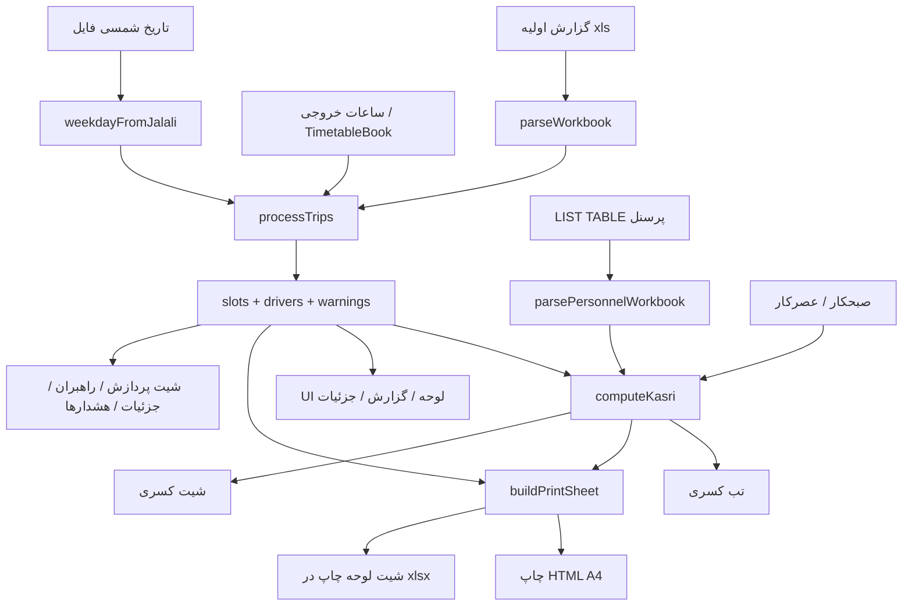

# نقشه فنی لوحه‌ساز سیر و اعزام

راهنمای کامل محصول، جریان کار، و نقشهٔ کد. مخاطب: نگهداری و توسعهٔ بعدی.

مخزن: [hoseindashti1981/Train-Operators-Trips](https://github.com/hoseindashti1981/Train-Operators-Trips)

نسخهٔ زنده (PWA): [https://hoseindashti1981.github.io/Train-Operators-Trips/docs/](https://hoseindashti1981.github.io/Train-Operators-Trips/docs/)

---

## ۱. این برنامه چیست

جایگزین وب برای ماکروی اکسل «لوحه‌ساز سیر و اعزام» خط ۵ مترو (گلشهر ↔ صادقیه).

گزارش روزانهٔ نرم‌افزار سیر (فایل `.xls` / `.xlsx` / `.xlsm`) را می‌گیرد و از آن **لوحهٔ خروجی** می‌سازد: فقط راهبر (مستر / H1) و کمک‌راهبر (اسلیو / R) روی **ساعت‌هایی که در شیت خروجی نوشته شده** قرار می‌گیرند.

هدف عملیاتی لوحه این نیست که کل روز را نشان بدهد. در عملیات، هر راهبر چند نیم‌تریپ می‌رود؛ این برنامه **اولین نیم‌تریپ هر نفر** را ثبت می‌کند تا فردا همان ساعت برایش تکرار نشود.

| نقش در لوحه | ستون چاپ | از گزارش اولیه |
|---|---|---|
| راهبر / مستر / اصلی | H1 | نوع اعزام شامل راهبر، مستر، اصلی، master |
| کمک‌راهبر / اسلیو | R | نوع اعزام شامل کمک، اسلیو، slave |
| راهبر آموزشی | T | نوع اعزام شامل آموزش — اختیاری در UI |

سایر نقش‌ها (مسئول شیفت، راهبر پایانه، …) وارد لوحهٔ تریپ نمی‌شوند.

---

## ۲. طرز کار برای کاربر

1. فایل **گزارش اولیه** را بکشید یا «بارگذاری اولیه» / «نمونه گزارش».
2. **نوع روز** را بگذارید خودکار (از تاریخ شمسی فایل) یا دستی: روز عادی / پنجشنبه / جمعه.
3. **صبحکار** و **عصرکار** را A / B / C انتخاب کنید (پیش‌فرض A صبح، B عصر).
4. در صورت نیاز **ساعات خروجی** را ویرایش کنید (در همین مرورگر ذخیره می‌شود).
5. **لیست پرسنل** (`LIST TABLE.xlsm`) یک‌بار بار می‌شود؛ برای به‌روز کردن، دکمهٔ همان نام.
6. تب‌ها:
   - **لوحه پردازش** — جدول ساعت × مبدأ با نام راهبر و کمک
   - **گزارش راهبران** — سورت فامیلی، شماره پرسنلی، ساعت‌ها یکی‌یکی
   - **جزئیات اعزام** — همهٔ نیم‌تریپ‌های نام‌دار
   - **هشدارها** — کسری ساعت لوحه، تعداد حرکت غیرمعمول
   - **کسری شیفت** — کسری صبح/عصر + اضافه‌کار
7. **خروجی اکسل** چند شیت می‌سازد. **چاپ لوحه** برگهٔ A4 شبیه فایل «لوحه اعزام» را به چاپ ویندوز می‌فرستد.

ذخیرهٔ محلی مرورگر:

| کلید | محتوا |
|---|---|
| `lohe-output-hours-v1` | ساعات گلشهر/تهران برای سه نوع روز |
| `lohe-personnel-v1` | لیست پرسنل خط ۵ |
| `lohe-shift-duty-v1` | حرف صبحکار / عصرکار |

سرور حساب کاربری ندارد؛ همهٔ پردازش در مرورگر است.

---

## ۳. دامنهٔ عملیاتی (فهم‌شده، بخشی در کد)

این بخش برای توسعهٔ بعدی است. برنامهٔ فعلی **تقویم ۲روزه و تفکیک ۹/۱۲ ساعته را هنوز اجرا نمی‌کند**؛ فقط حرف صبحکار/عصرکار را از UI می‌گیرد.

### دو مدل شیفت

- **۹ ساعته:** در هر شیفت کاری ۴ نیم‌تریپ. چرخهٔ ۲+۲+۲: دو روز صبح، دو روز عصر، دو روز استراحت.
- **۱۲ ساعته:** چرخه جدا. دو روز **روزِ میان** `07:30–19:30` (۶ نیم‌تریپ)، دو روز **شب** `19:30–07:30 فردا` (۲ نیم‌تریپ)، دو روز استراحت.

حروف A/B/C برای هر دو نوع هست و **همیشه جفت‌اند**: اگر A صبحکار باشد، ۹A صبح است و ۱۲A روزکار؛ همان روز B عصرکار است پس ۱۲B شبکار.

ساعت کارت ۱۲ ساعته `07:30` / `19:30` است؛ شروع تریپ روزکار حدود `08:00` و شب حدود `19:50`. این‌ها یکی نیستند.

شب از نیمه‌شب رد می‌شود:

- **روز اول چرخه:** صبح‌زود = ۱۲ ساعتهٔ **شیفت دیشب** (حرف جدا) → روی لوحه تا ۳ گروه ۱۲ ساعته.
- **روز دوم چرخه:** صبح‌زود و آخر شب **یک حرف** → ۲ گروه ۱۲ ساعته.

### این لیست ساعت عمداً چه می‌گیرد

گلشهر: ۳ نیم‌تریپ اول ۱۲ صبح‌زود/دیشب + حدود ۱۱ نیم‌تریپ اول ۹ صبح + حدود ۱۴ نیم‌تریپ اول ۹ عصر + ۳ نیم‌تریپ اول ۱۲ شب.

تهران: اولین تریپ صبح = ۱۲ شبِ قبل + ۳ نیم‌تریپ اول ۹ صبح + ۳ یا ۴ نیم‌تریپ اول ۹ عصر.

اسامی ۱۲ ساعتهٔ **روزکار** وسط روز در این لیست نمی‌آیند. ساعت‌ها حدودی‌اند و با جدول همان روز عوض می‌شوند.

---

## ۴. معماری کلی

دو مسیر استقرار روی یک کد منبع:

```text
مرورگر (بدون سرور پردازش)
        │
        ▼
 LoheApp  ── ساعات (localStorage)
        │   ── پرسنل (localStorage)
        │   ── صبحکار/عصرکار (localStorage)
        ▼
 processWorkbook(ArrayBuffer)
        │
        ├─ parse-report   → Trip[]
        ├─ jalali         → نوع روز از تاریخ شمسی
        ├─ templates      → TimetableRow[]
        ├─ match          → SlotAssignment[]
        ├─ driver-report  → DriverRow[]
        └─ kasri          → کسری / اضافه‌کار  (از لیست پرسنل)
                │
                ├─ UI جدول‌ها + چاپ HTML
                └─ export-workbook / print-sheet → .xlsx
```

| محیط | ورودی | خروجی |
|---|---|---|
| پیش‌نمایش Grok / Vercel | TanStack Start + Vite روی `:8080` | SSR/CSR کامل پروژه |
| GitHub Pages | بیلد استاتیک `vite.pages.config.ts` | پوشهٔ `docs/` با `base=/Train-Operators-Trips/docs/` |

پردازش فایل اکسل فقط کلاینت است (`xlsx` با import پویا تا SSR نشکند).

---

## ۵. جریان داده



تطبیق هر خانهٔ لوحه: **مبدأ + ساعت + نقش**. جای ستون در فایل اولیه مهم نیست؛ عنوان ستون پیدا می‌شود.

نرمال‌سازی فارسی: `ي/ى → ی`، `ك → ک`، ارقام فارسی/عربی، حذف نیم‌فاصله. نام نمایشی: `نام‌خانوادگی + نام`.

---

## ۶. نقشهٔ ماژول‌ها

### UI

| فایل | نقش |
|---|---|
| [`src/routes/index.tsx`](src/routes/index.tsx) | صفحهٔ اصلی؛ فقط `LoheApp` |
| [`src/components/lohe-app.tsx`](src/components/lohe-app.tsx) | پوسته، بارگذاری، تب‌ها، آمار، کسری، خروجی |
| [`src/components/hours-editor.tsx`](src/components/hours-editor.tsx) | ویرایش ساعات سه نوع روز |
| [`src/components/lohe-print.tsx`](src/components/lohe-print.tsx) | جدول چاپ A4؛ اضافه‌کار بولد/ایتالیک/خاکستری |
| [`src/components/pwa-bar.tsx`](src/components/pwa-bar.tsx) | نصب PWA و وضعیت شبکه |
| [`src/styles.css`](src/styles.css) | Tailwind + استایل چاپ |

### موتور لوحه — [`src/lib/lohe/`](src/lib/lohe/)

```text
index.ts            صادرات یکپارچه
types.ts            Trip, Slot, ProcessResult, …
xlsx-load.ts        import پویای SheetJS
normalize.ts        فارسی، نقش، مبدأ، ساعت، displayName
parse-report.ts     خواندن گزارش پراکنده / سلول ادغام‌شده
jalali.ts           تاریخ شمسی → روز هفته و DayKind
templates.ts        ساعات پیش‌فرض weekday/thursday/friday
timetable-store.ts  ذخیره/بازیابی ساعات
match.ts            پر کردن هر ساعت لوحه از Trip[]
driver-report.ts    تجمیع نفر، سورت فامیلی
process.ts          ارکستراسیون parse + match + گزارش
personnel.ts        خواندن LIST TABLE و ShiftDuty
kasri.ts            کسری صبح/عصر و اضافه‌کار
print-sheet.ts      AOA چاپ شبیه اکسل اعزام
export-workbook.ts  ورک‌بوک چندشیتی
engine.node-test.ts تست‌های موتور
```

وابستگی (بدون حلقه):

```text
normalize ← parse-report
          ← match
          ← driver-report
          ← personnel
          ← jalali          ← process
templates ← timetable-store
          ← match           ← process
personnel ← kasri           ← LoheApp / print-sheet / export
process   ← LoheApp
print-sheet ← lohe-print + export-workbook
```

### PWA و آدرس

| فایل | نقش |
|---|---|
| [`src/lib/pwa/policy.ts`](src/lib/pwa/policy.ts) | ثبت SW فقط در context امن، نه روی grok.com |
| [`src/lib/pwa/register.ts`](src/lib/pwa/register.ts) | `sw.js` با `scope` نسبی |
| [`src/lib/public-url.ts`](src/lib/public-url.ts) | مسیر دارایی نسبت به `BASE_URL` |
| [`public/sw.js`](public/sw.js) | precache پوسته + شبکه برای ناوبری |
| [`public/manifest.json`](public/manifest.json) | آیکون، `file_handlers` برای xls |
| [`vite.pages.config.ts`](vite.pages.config.ts) | بیلد استاتیک GitHub Pages |
| [`scripts/build-pages.mjs`](scripts/build-pages.mjs) | کپی `dist-pages` → `docs/` |
| [`index.md`](index.md) + [`_config.yml`](_config.yml) | ریدایرکت ریشه به `/docs/` |

---

## ۷. قراردادهای مهم کد

### گزارش اولیه

هدر از روی متن ستون کشف می‌شود نه ایندکس ثابت: نوع اعزام، نام، نام خانوادگی، کد پرسنلی، مبدأ، مقصد، زمان حرکت، تاریخ پردازش.

شیت با بیشترین امتیاز هدر انتخاب می‌شود. سلول ادغام‌شده پر می‌شود. ساعت هم رشته است هم سریال اکسل (بدون شیفت timezone).

اگر فایل لوحهٔ خالی / قالب باشد، رد می‌شود.

### ساعات خروجی

هر ردیف زوج `[گلشهر، تهران]` است. خالی = آن سمت حرکت ندارد. ردیف کاملاً خالی = فاصلهٔ بصری در جدول.

بخش روز از روی ساعت نمونه:

- صبح: قبل از ۱۲ (و نه بعد از ۱۹)
- میان‌روز: ۱۲ تا ۱۹
- پایان خط / عصر: ≥ ۱۹ یا < ۴

برای کسری: صبح + میان‌روز = دورهٔ **صبحکار**؛ پایان خط = **عصرکار**.

### پرسنل و کسری

ستون‌های LIST TABLE: ردیف، نام، نام خانوادگی، کد پرسنلی، سمت، شیفت کاری، نوع شیفت (A/B/C)، محل کار.

کسری فقط برای **راهبر قطار** غیر منفک. پایانه و مسئول شیفت در استخر کسری نیستند.

- کسری صبح: حرف = صبحکار و در تریپ‌های صبح/میان‌روز لوحه نیست.
- کسری عصر: حرف = عصرکار و در تریپ‌های عصر نیست.
- اضافه‌کار: روی لوحه هست ولی حرفش نه صبحکار است نه عصرکار (معمولاً استراحت). در چاپ بولد + ایتالیک + زمینه خاکستری. در اکسل شیت «کسری» هم لیست می‌شود.

تطبیق نفر: اول کد پرسنلی، بعد نام فشرده.

### خروجی اکسل

1. پردازش  
2. گزارش راهبران  
3. جزئیات اعزام  
4. هشدارها  
5. لوحه چاپ (قالب A4 با ستون‌های R / T / H1 و پاورقی کسری)  
6. کسری (اگر لیست پرسنل باشد)

چاپ مرورگر همان جدول را با `@media print` نشان می‌دهد؛ بقیهٔ UI مخفی است.

---

## ۸. نمونه فایل‌ها

| مسیر | کاربرد |
|---|---|
| `public/samples/gozaresh-avaliye.xls` | گزارش روزانه نمونه |
| `public/samples/list-table.xlsm` | لیست پرسنل خط ۵ (۱۸۹ نفر) |

---

## ۹. تست

```bash
npm test
```

موتور لوحه: `node --import jiti/register --test src/lib/lohe/engine.node-test.ts`

پوشش فعلی شامل نقش فارسی/عربی، سریال ساعت، چهارشنبه بودن `1402/03/03`، تطبیق مستر/اسلیو نمونه، سورت فامیلی، ساعات سفارشی، رد قالب خالی، چاپ، و کسری از LIST TABLE است.

---

## ۱۰. اجرا و استقرار

محلی:

```bash
npm install
npm run dev          # http://localhost:8080
npm run build:pages  # بازسازی docs/ برای GitHub Pages
```

GitHub Pages از `main` / پوشهٔ `docs` سرو می‌شود. ریشه با Jekyll به `/docs/` می‌رود. `.nojekyll` داخل `docs/` است تا Bundler فایل‌های زیرخط‌دار را نخورد.

PWA را از پیش‌نمایش Grok نصب نکنید (iframe). از آدرس GitHub در تب جدا: کروم Install app / آیفون Add to Home Screen. بار اول آنلاین؛ بعد فایل محلی آفلاین پردازش می‌شود.

---

## ۱۱. کارهای انجام‌شده (سیر محصول)

1. ماژول VBA اکسل → وب‌اپ پردازش گزارش پراکنده.
2. تطبیق عنوان ستون + مبدأ/ساعت/نقش؛ نه ایندکس ثابت.
3. شیت راهبران با سورت فامیلی و ساعت‌های یکی‌یکی.
4. ویرایش ساعات خروجی و ذخیره در مرورگر.
5. تشخیص روز از تاریخ شمسی.
6. PWA تقریباً آفلاین + مسیر GitHub Pages `/docs/`.
7. دکمهٔ چاپ لوحه شبیه فایل اعزام (تاریخ پویا، ساعات همان روز).
8. لیست پرسنل + کسری صبح/عصر + علامت اضافه‌کار.

هنوز ساخته نشده (عمداً، تا مدل شیفت کامل شود):

- تقویم تاریخ → کدام حرف صبحکار/عصرکار/شبِ دیروز است
- تفکیک ۹ ساعته و ۱۲ ساعته در کسری
- روز اول/دوم چرخه برای صبح‌زود ۱۲ ساعته
- ذخیرهٔ لیست راهبران هر شیفت جدای از LIST TABLE

---

## ۱۲. نقاط ورود برای تغییر بعدی

| اگر بخواهی… | از اینجا شروع کن |
|---|---|
| ساعات پیش‌فرض لوحه | `templates.ts` |
| منطق تطبیق خانه | `match.ts` |
| کسری با ۹/۱۲ و چرخهٔ ۲روزه | `kasri.ts` + `ShiftDuty` در `personnel.ts` |
| قالب چاپ اکسل | `print-sheet.ts` و `lohe-print.tsx` |
| شیت‌های خروجی | `export-workbook.ts` |
| هدر گزارش اولیه جدید | `scoreHeaderCell` در `parse-report.ts` |
